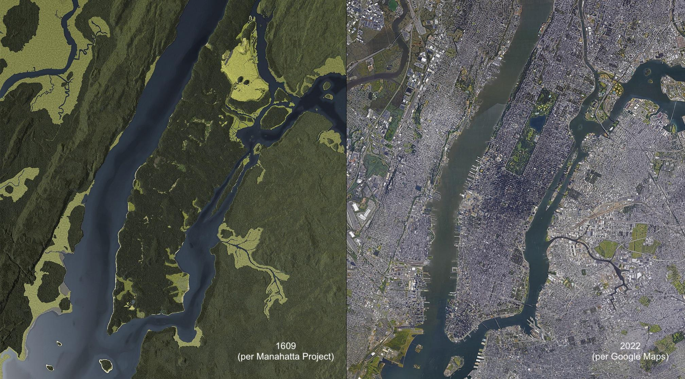

# Manhattan 1609
An historically accurate reconstruction of Manhattan (and nearby shorelines) as of Henry Hudson's 1609 arrival

- Built in Unreal Engine 5.2.  Will run on desktop PCs, Macs -- eventually mobile, VR, and AR devices
- Inspired by the awesome [Manahatta Project](https://en.wikipedia.org/wiki/Mannahatta_Project) (aka [Welikia](https://welikia.org/))
- As part of the larger [TimeWalk.org](https://github.com/TimeWalkOrg) project, this model will eventually incorporate terrain and building models for 1660, 1776, 1882, and 2023 (enabling virtual "time travel")
- An open-source project: contact us to contribute!
- Upwork project spec [here](https://www.upwork.com/jobs/~010dbfb54f75d8b979)
- Alpha prototype video fly-through: [Manhattan 1609](https://youtu.be/si5Ehnku4SM)

[Source: Manahatta Project](https://viewing.nyc/this-side-by-side-rendering-and-aerial-photo-shows-manhattan-1609-and-2017/)

[Source: OasisNYC.net](http://www.oasisnyc.net/map.aspx?zoom=4&x=985510.42&y=199447.92&etabs=0&categories=TRANSREF%2CPARKS_OPENSPACE%2CPROPERTY_INFO%2CHISTORICAL%2CBOUNDARIES&mainlayers=Mnhta_Water%2CLOTS&labellayers=&satellite=1609)

Screenshot of 1609 terrain (rendered in Unreal Engine):

